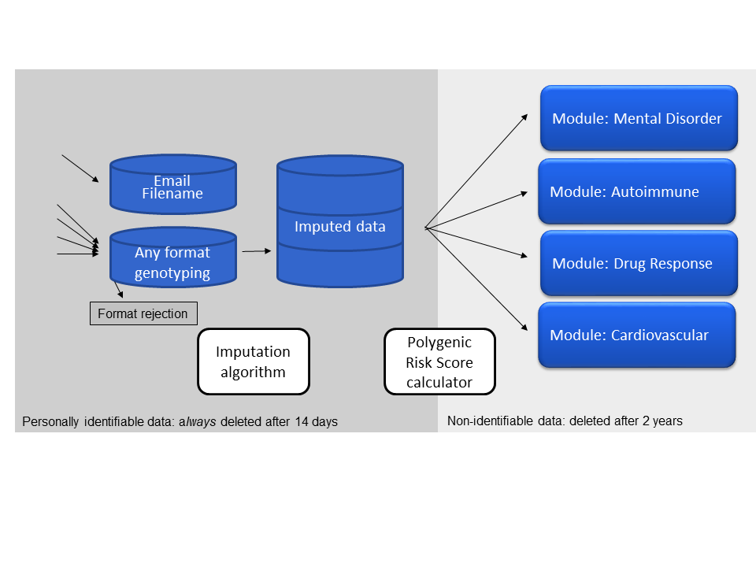

# Impute.me code

This introduction is divided into three sections: 

* the contents sent by email to the user on finishing of a full analysis-run, 
* the use and setup of the analysis modules, 
* the algorithm components behind-the-scenes,

Together, these three aspects make up the functionality of impute.me. Further details on the underlying theory is available in [Front. Genet., 30 June 2020](https://doi.org/10.3389/fgene.2020.00578).

## Part 1: Downloads descriptions

On each completed analysis-run an email is sent with the user's uniqueID. This uniqueID can be used to browse the modules described in part 2, but in addition three links are provided for direct download:

**Simple-format** imputed output. This format is also sometimes called 23andme-format because it was standardized by the company 23andme. It contains rows of all SNPs with rs-ID, chromosome, position, and genotype. When given as output from the _impute.me_-site, the only difference is that _a lot_ more SNPs are available. This is a consequence of the imputation. The file is zipped and divided by chromosome.

**Gen-format files** contains similar information to the 23andme-format files, i.e. all your imputed SNPs. But they do so in a more completely descriptive format, one that also reflects considerations of statistical uncertainty of genotype calls. This format is called the [gen-format](https://jmarchini.org/file-formats/). The key to interpretation is that each of the three right-most columns contains probabilistic information regarding your genotype. This means that a value of _A C 1 0 0_ is almost sure to be A/A, whereas _A C 0.7 0.3 0_ could be interpreted as both A/A but with some probability of being A/C.

**JSON-format files** contains calculated phenotypical data. This file contains the output of all the genetic-calculators that a sample is subjected to at _impute.me_. The JSON-format is made to be computer-readable, but many good [online viewers](http://jsonviewer.stack.hu/) exists, so you can easily inspect the data yourself. However, since the same information is given in the browsable modules described in next section, the only purpose of providing this format is long-term storage and data-interchange.

## Part 2: Module design description

Each specific module function is documented by their UI-provided description. The general setup requires the input of a uniqueID, which links to the user's data. For many of the modules, the calculations are trivial. For example this could be the reporting of presence and/or absence of a specific genotype. For others, we rely heavily on polygenic risk scores. Three approaches to polygenic risk scores are implemented in the function [get_GRS_2](https://github.com/lassefolkersen/impute-me/blob/5901cb626d0e50a01106d74c48540a41100974a6/functions.R#L1287). Since it is an over-arching concept, the different types of risk score calculations are explained here:

**Basic count score**. Basically just counting the effect alleles. This is the most simple setup of polygenic risk scores. It is intuitive to understand - the more risk alleles, the higher the score. The main drawback is that it doesn't distinguish SNPs with large and small effects.

&nbsp;&nbsp;&nbsp;&nbsp;&nbsp;&nbsp;Count-score =  Σ Effect-allele-countsnp (I)

**Weighted-score**. A score that is weighted by the effect size of each SNP. This has the added benefit of weighting SNPs with large effect sizes more than SNPs with small effect sizes. Note that _beta_ is changed for _log(OR)_ as applicable for binary traits. The only draw-back of this score type is that it is on an arbitrary scale and does little to inform about risk compared to the rest of the population.

&nbsp;&nbsp;&nbsp;&nbsp;&nbsp;&nbsp;Weighted-score =  Σ Betasnp * Effect-allele-countsnp (II)

**Z-score**. A score that is given in standard-deviations above or below the average risk-score for that population. This specific implementation of the Z-score is [found here](https://github.com/lassefolkersen/impute-me/blob/5901cb626d0e50a01106d74c48540a41100974a6/functions.R#L1387-L1404). The _frequencysnp_ is obtained from 1000 genomes data for the relevant super-population. _Effect-allele-count_ and _Beta_ is used as in previous scores. The _Standard-deviationpopulation_ is calculated according to [this code](https://github.com/lassefolkersen/impute-me/blob/5901cb626d0e50a01106d74c48540a41100974a6/functions.R#L1396-L1404). In many of the modules an extra step is added where the Z-score is converted to percentage of population with lower score. This is done with the standard [pnorm](https://stat.ethz.ch/R-manual/R-devel/library/stats/html/Normal.html) function, i.e. we assume everything is normally distributed. To check the validity of this assumption, some modules have an option to compare to [real distributions](https://www.impute.me/AllDiseases/).

&nbsp;&nbsp;&nbsp;&nbsp;&nbsp;&nbsp;Population-scoresnp = frequencysnp * 2 * betasnp (III)

&nbsp;&nbsp;&nbsp;&nbsp;&nbsp;&nbsp;Zero-centered-score =  Σ Betasnp * Effect-allele-countsnp - Population-scoresnp (IV)

&nbsp;&nbsp;&nbsp;&nbsp;&nbsp;&nbsp;Z-score = Zero-centered-score / Standard-deviationpopulation (V)

These scores are extensively used as described in each module. For further understanding of each module, refer to source code of that module. This [pdf-file](2018-09-20_prs_explanatory_slides.pdf) contains further illustrated examples of PRS derivation. The set up of input SNPs is sought to be as complete as possible, e.g. using [LDpred info](https://github.com/lassefolkersen/impute-me/tree/master/prs). However, more often it is based on top-significant (pruned) hits out of necessity. This is also indicated on a per-module basis.

When reading the code for each module, the main parts are the ui.R and a server.R file. The details of this setup of this can be found in the <a href='http://shiny.rstudio.com/'>R/Shiny</a> documentation. Shiny is the interface language that have been used to create these modules. A template module which contains the very minimal configuration is found in the ['template'](https://github.com/lassefolkersen/impute-me/tree/master/template) folder. Additional module-specific files that are often used is the SNPs_to_analyze.txt file and the export_script.R, further described elsewhere.

## Part 3: Imputation algorithm description

After upload of data, a central aspect of the analysis engine is the performance of an imputation-process. The purpose of this process is to 'fill in the blanks', meaning to provide educated guesses of missing SNPs. Imputation allows the analysis modules to connect to the latest research as provided by the modules. Unlike the two previous sections, it is not at all necessary to understand these aspects of the impute.me algorithm. They are provided here for reference:

(1) *prepare_individual_genome* (a [function](https://github.com/lassefolkersen/impute-me/blob/05b6df2fc4f2474056939e63a3cc3945c281af15/functions.R#L31)) which is triggered at data-submission time (not cron-job dependent). This function simply unpacks the data, copies it to the designated imputation area (~/imputations), performs a few data consistency checks and assigns an unique id to each submission.

(2) *run_imputation* (a [function](https://github.com/lassefolkersen/impute-me/blob/af1bca3c0ab5d6f93ff1410bdf80881576a2075b/functions.R#L322)) is triggered by the cron-job checking for ready data in the imputation area (~/imputations). It consists of a series of calls to bash-based programs. First a [shapeit call](https://mathgen.stats.ox.ac.uk/genetics_software/shapeit/shapeit.html) is made to phase the data correctly. Note that there is quite a lot of extra work involved in avoiding errors from single-sample-homozygote problems and such (up untill the cmd4 call). After shape-it calls, a call to [impute2](http://mathgen.stats.ox.ac.uk/impute/impute_v2.html) is made and the end-product of this function is per-chromosome gen-files entitled "step_7_chr_xx", because they come from the seventh step of calculation. 

(3) *summarize_imputation* (a [function](https://github.com/lassefolkersen/impute-me/blob/af1bca3c0ab5d6f93ff1410bdf80881576a2075b/functions.R#L494)) is run immediately after run_imputation, in the cron-job. The goal of this function is to organize and summarize the per-chromosome gen-files: saving as 1) a gen-file with probability-estimate-containing imputation data, and 2) a 'simple'-format file in which the calls are already made. The current threshold is 0.9, per the <a href='http://www.well.ox.ac.uk/~cfreeman/software/gwas/gtool.html'>gtools</a> default setting (but it is variable per use-case - PRS for example may be robust to lower thresholds). The key to this function is the extensive splitting that minimizes the memory footprint. This could otherwise become very large, particularly for the long chromosomes, and would prevent cheap(er) hub-to-node running. 

(4) *imputation_cron_job.R* (a [script file](https://github.com/lassefolkersen/impute-me/blob/master/imputeme/imputation_cron_job.R)). This file is called as a cron-job. It checks what input-data is ready and then calls the two functions described above (2 and 3), as well as the per-module export scripts (7). The extra code in the file is used to determine if it should run as a hub-job or a node-job; node jobs are prefered, because these functions are computationally expensive. In a hub-only setup, calculations are run on the same computer as the web-site interface. In the hub+node-setup, a central hub computer stores data and shows the web-site, while a scalable number of node-computers perform all computationally heavy calculations.

(5) *bulk_imputation_cron_job.R* (a [script file](https://github.com/lassefolkersen/impute-me/blob/master/imputeme/bulk_imputation_cron_job.R)). Similar to the *imputation_cron_job.R* (4) file, this calls the  cron-job driven functions for imputation and summary. The difference with this mode is that it processes in multiples of ten samples. This economises use of computer-power, at the cost of taking more time from data-submission to finished results. 

(6) *run_bulk_imputation* (a [function](https://github.com/lassefolkersen/impute-me/blob/47d54247833f79cd94f2560a507bbf7c909c5f2e/functions.R#L1812)). Similar to *run_imputation* (3), but called from the *bulk_imputation_cron_job.R* script (5). It is however, followed by the regular *summarize_imputation* (3) because there is no CPU-saving potential in merging that aspect.

(7) *export_script.R* (several scripts, e.g. [here](https://github.com/lassefolkersen/impute-me/blob/master/AllDiseases/export_script.R) and [here](https://github.com/lassefolkersen/impute-me/blob/master/BRCA/export_script.R)) for each module, this script contains computationally intensive calculations used for pre-calculations of derived data. For details on each script, refer to the code in the module as well as [section 2](#part-2-module-design-description). The scripts are activated using the [run_export_script-function](https://github.com/lassefolkersen/impute-me/blob/af1bca3c0ab5d6f93ff1410bdf80881576a2075b/functions.R#L1602) (e.g. [here](https://github.com/lassefolkersen/impute-me/blob/af1bca3c0ab5d6f93ff1410bdf80881576a2075b/imputeme/imputation_cron_job.R#L159)).

In summary these functions can be illustrated with the following schematic:

The following components are deleted 14 days after processing:
 * [input-data](https://github.com/lassefolkersen/impute-me/blob/af1bca3c0ab5d6f93ff1410bdf80881576a2075b/imputeme/deletion_cron_job.R#L70)
 * [imputed-data](https://github.com/lassefolkersen/impute-me/blob/af1bca3c0ab5d6f93ff1410bdf80881576a2075b/imputeme/deletion_cron_job.R#L68-L69)
 * [email and filename](https://github.com/lassefolkersen/impute-me/blob/af1bca3c0ab5d6f93ff1410bdf80881576a2075b/imputeme/deletion_cron_job.R#L36-L37) as linked to genetic data (*non-linked email is saved elsewhere per terms-of-service*)
 
Remaining data consist of all the derived data, such as disease-gene-scores. Although this includes some genotypes, it is not considered personally traceable because these genotypes cannot be used to track people systematically, e.g. using software like [GEDmatch](https://www.gedmatch.com).

