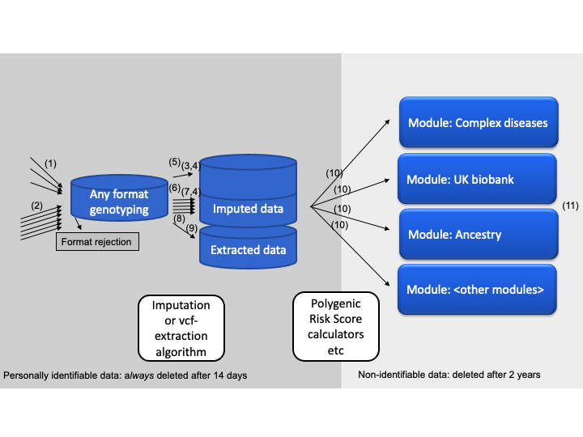

# Impute.me code

This introduction is divided into three sections: 

* the contents sent by email to the user on finishing of a full analysis-run, 
* the calculations that are used to present data in each module, 
* the algorithm components behind-the-scenes,

Together, these three aspects make up the functionality of impute.me. Details on the underlying theory is available in [Front. Genet., 30 June 2020](https://doi.org/10.3389/fgene.2020.00578). Additional literature related to this project is described in the ['about' section of impute.me](https://www.impute.me/contact/).

## Part 1: Downloads descriptions

On each completed analysis-run an email is sent with the user's uniqueID. A uniqueID consists of the prefix *id_* and then 9 random numbers or letters. This uniqueID can be used to browse the modules on the web-interface. described in part 2, but in addition two links are provided for direct download:

**Gen-format files** a file with all the SNPs that are available after the imputation processing. Each line contains one SNP with rs-ID, chromosome, position, and genotype. The genotype is written in a slightly more complex format than the usual A/G, A/C format. This format reflects considerations of statistical uncertainty of genotype calls. This format is called the [gen-format](https://jmarchini.org/file-formats/). The key to interpretation is that each of the three right-most columns contains probabilistic information regarding your genotype. This means that a value of _A C 1 0 0_ is almost sure to be A/A, whereas _A C 0.7 0.3 0_ could be interpreted as both A/A but with some probability of being A/C.

**JSON-format files** contains calculated phenotypical data. This file contains the output of all the genetic-calculators that a sample is subjected to at _impute.me_. The JSON-format is made to be computer-readable, but many good [online viewers](http://jsonviewer.stack.hu/) exists, so you can easily inspect the data yourself. However, since the same information is given in the browsable modules described in next section, the only purpose of providing this format is long-term storage and data-interchange.

## Part 2: Calculation modules

The general setup of each calculation module is that it requires the input of a uniqueID, which links to the user's data. This can then access genotype as well as broad selection of pre-computed scores. For many of the modules, the calculations are trivial. For example this could be the reporting of presence and/or absence of a specific genotype. For others, we rely on more advanced polygenic risk scores. There are many approaches to polygenic risk scores, ranging from very simple to very complex. Several are in use at impute.me, and each is explained here in order of increasing complexity:

**Basic count score**. Basically just counting the effect alleles. This is the most simple setup of polygenic risk scores. It is intuitive to understand - the more risk alleles, the higher the score. The main drawback is that it doesn't distinguish SNPs with large and small effects.

&nbsp;&nbsp;&nbsp;&nbsp;&nbsp;&nbsp;Count-score =  Σ Effect-allele-countsnp (I)

**Weighted-score**. A score that is weighted by the effect size of each SNP. This has the added benefit of weighting SNPs with large effect sizes more than SNPs with small effect sizes. Note that _beta_ is changed for _log(OR)_ as applicable for binary traits. The only draw-back of this score type is that it is on an arbitrary scale and does little to inform about risk compared to the rest of the population.

&nbsp;&nbsp;&nbsp;&nbsp;&nbsp;&nbsp;Weighted-score =  Σ Betasnp * Effect-allele-countsnp (II)

**Z-score**. A score that is given in standard-deviations above or below the average risk-score for that population. This specific implementation of the Z-score is [found here](https://github.com/lassefolkersen/impute-me/blob/54be62b819ddb6f7220eb4b57a8c50c9717848a8/functions.R#L4088-L4109). The _frequencysnp_ is obtained from 1000 genomes data for the relevant super-population. _Effect-allele-count_ and _Beta_ is used as in previous scores. The _Standard-deviationpopulation_ is calculated according to [this code](https://github.com/lassefolkersen/impute-me/blob/54be62b819ddb6f7220eb4b57a8c50c9717848a8/functions.R#L4097-L4105). In many of the modules an extra step is added where the Z-score is converted to percentage of population with lower score. This is done with the standard [pnorm](https://stat.ethz.ch/R-manual/R-devel/library/stats/html/Normal.html) function, i.e. we assume everything is normally distributed. It is also possible, under advanced options, to instead compare the score to the distribution of all other ancestry-matched users.

&nbsp;&nbsp;&nbsp;&nbsp;&nbsp;&nbsp;Population-scoresnp = frequencysnp * 2 * betasnp (III)

&nbsp;&nbsp;&nbsp;&nbsp;&nbsp;&nbsp;Zero-centered-score =  Σ Betasnp * Effect-allele-countsnp - Population-scoresnp (IV)

&nbsp;&nbsp;&nbsp;&nbsp;&nbsp;&nbsp;Z-score = Zero-centered-score / Standard-deviationpopulation (V)

**Z-score ('all-SNPs')**
This implementation of the Z-score algorithm is similar to the one described above, but the calculations are made through the [Plink 2.0 'score'](http://doi.org/10.13140/RG.2.2.10081.53602/1) functionality, which allows the use of polygenic weight schemes with hundreds of thousands of variants. The only difference between this implementation and the previous, is that normalization is only performed in comparison to the distribution of other ancestry-matched users. Otherwise the switch between the two approaches are largely seamless.

**Absolute risk scores**
An area of active development is the calculation of absolute risk scores, i.e. what the lifetime percentage risk of disease is, given a specific Z-score. Descriptions of this approach is further described [here](https://www.medrxiv.org/content/10.1101/2021.04.16.21255481v1) and a prototype module that can accept impute-me derived Z-scores is available [here](https://opain.github.io/GenoPred/PRS_to_Abs_tool.html).

## Part 3: Behind the scenes

Unlike the two previous sections, which are of some importance as website-user, it is not necessary to understand the detailed processes of data-handling. An overview is provided here for reference. This is useful if you want to make custom setups, e.g. when running the algorithms locally in a [docker container](https://hub.docker.com/repository/docker/lassefolkersen/impute-me), where many of the data flows can be tuned and modified. 

(1) *prepare_individual_genome* (a [function](https://github.com/lassefolkersen/impute-me/blob/54be62b819ddb6f7220eb4b57a8c50c9717848a8/functions.R#L186-L830)) which is triggered at data-submission time (not cron-job dependent). This function simply unpacks the data, copies it to the designated imputation area (`~/imputations`) or extraction area (`~/vcfs`), performs a few data consistency checks and assigns an unique id to each submission. The reason for a dedicated preparation function is that it needs to give immediate feed-back to users and therefore have to work quickly.

(2) *prepare_imputemany_genome* (a [function](https://github.com/lassefolkersen/impute-me/blob/54be62b819ddb6f7220eb4b57a8c50c9717848a8/functions.R#L839-L1200)) which is triggered at data-submission time (also not cron-job dependent), when receiving bulk microarray data consisting of many genomes. This function simply unpacks and splits the data, copies it to the designated imputation area (`~/imputations`), performs a few data consistency checks and assigns an unique id to each submission. The function is activated from the [imputemany-module](https://www.impute.me/imputemany), which is only open to free use through the [docker interface](https://hub.docker.com/repository/docker/lassefolkersen/impute-me).

(3) *run_imputation* (a [function](https://github.com/lassefolkersen/impute-me/blob/54be62b819ddb6f7220eb4b57a8c50c9717848a8/functions.R#L1573-L1865)) is triggered by the cron-job checking for ready data in the imputation area (`~/imputations`). It consists of a series of calls to bash-based programs. First a [shapeit call](https://mathgen.stats.ox.ac.uk/genetics_software/shapeit/shapeit.html) is made to phase the data correctly. Note that there is quite a lot of extra work involved in avoiding errors from single-sample-homozygote problems and such (up untill the cmd4 call). After shape-it calls, a call to [impute2](http://mathgen.stats.ox.ac.uk/impute/impute_v2.html) is made and the end-product of this function is per-chromosome gen-files entitled e.g. "step_7_chr_3", because they come from the seventh step of calculation, at chromosome 3. 

(4) *summarize_imputation* (a [function](https://github.com/lassefolkersen/impute-me/blob/54be62b819ddb6f7220eb4b57a8c50c9717848a8/functions.R#L2747-L3099)) is run immediately after *run_imputation*, in the cron-job. The goal of this function is to organize and concatenate the per-chromosome gen-files, as well as transferring all relevant output from the calculation area (`~/imputations`) to the final storage area (`~/data`). It can also output a so-called simple-format with hard-calls, although this is switched off by default. The *summarize_imputation* function uses extensive splitting to minimize the memory footprint that would prevent cheap(er) hub-to-node running.

(5) *imputation_cron_job.R* (a [script file](https://github.com/lassefolkersen/impute-me/blob/54be62b819ddb6f7220eb4b57a8c50c9717848a8/imputeme/imputation_cron_job.R)). This file is called as a cron-job. It checks what input-data is ready and then calls the two functions described above (3 and 4), as well as the per-module export scripts (10). It will also determine, from configuration-file, if the job should run as a hub-job or a node-job; node jobs are prefered, because these functions are computationally expensive. In a hub-only setup, calculations are run on the same computer as the web-site interface. In the hub+node-setup, a central hub computer stores data and shows the web-site, while a scalable number of node-computers perform all computationally heavy calculations.

(6) *bulk_imputation_cron_job.R* (a [script file](https://github.com/lassefolkersen/impute-me/blob/54be62b819ddb6f7220eb4b57a8c50c9717848a8/imputeme/bulk_imputation_cron_job.R)). Similar to the *imputation_cron_job.R* (5) file, this calls the  cron-job driven functions for imputation and summary. The difference with this mode is that it processes in multiples of ten samples. This economises use of computer-power, at the cost of taking more time from data-submission to finished results. 

(7) *run_bulk_imputation* (a [function](https://github.com/lassefolkersen/impute-me/blob/54be62b819ddb6f7220eb4b57a8c50c9717848a8/functions.R#L1874-L2353)). Similar to *run_imputation* (3), but called from the *bulk_imputation_cron_job.R* script (6). It is however, followed by the regular *summarize_imputation* (4) because there is not much potential for saving processing power if merging that aspect.

(8) *vcf_handling_cron_job.R* (a [script file](https://github.com/lassefolkersen/impute-me/blob/54be62b819ddb6f7220eb4b57a8c50c9717848a8/imputeme/vcf_handling_cron_job.R)). Similar to (5) and (6), this script is called as a cron-job to check for waiting vcf-files (in `~/vcfs`) and then extract the relevant variants and triggering downstream analysis calculators. Function (1) *prepare_individual_genome* automatically determines if received files should go to `~/imputations` or `~/vcfs` area, but only nodes set up to run this function will check the `/vcfs` area. For setups that need to override processing scheduling, e.g. when used in sequencing-pipelines, this script file is the one to adapt and lift out of the cron-job scheduling.

(9) *convert_vcfs_to_simple_format* (a [function](https://github.com/lassefolkersen/impute-me/blob/54be62b819ddb6f7220eb4b57a8c50c9717848a8/functions.R#L2359-L2738)). Is triggered by the cron-job checking for ready data in the extraction area (`~/vcfs`). The function will then handle vcf-files from whole-genome sequencing in order to create a format compatible with downstream analysis calculators. The format, which is indicated as *Extracted data* in the schematics above, is virtually the same as the output of a microarray imputation. The difference is that only a set of ~2.2 million variants that are known to be required for down-stream analysis modules are extracted from the vcf-file in this step. This is done according to the approach [described here](http://doi.org/10.13140/RG.2.2.34644.42883), where missing data is treated as homozygote reference. For that reason, acceptance criteria in function (1) *prepare_individual_genome* are very strict for vcf-files. This is done to avoid exon sequencing and low-coverage sequencing processed using this approach.

(10) *export_script.R* (several scripts, e.g. [here](https://github.com/lassefolkersen/impute-me/blob/master/AllDiseases/export_script.R) and [here](https://github.com/lassefolkersen/impute-me/blob/master/BRCA/export_script.R)) for each module, this script contains various other computationally intensive calculations used for pre-calculations of derived data. The idea is that even after the computationally expensive imputation and extraction steps, there are many of the scores that will benefit from pre-processing at time of first analysis. For speed, the *export_script.R* may also optionally be preceded by a call to [crawl_for_snps_to_analyze](https://github.com/lassefolkersen/impute-me/blob/54be62b819ddb6f7220eb4b57a8c50c9717848a8/functions.R#L4156-L4267) which will prepare quick-access short lists of required variants. All *export_script.R* can be systematically activated using the [run_export_script-function](https://github.com/lassefolkersen/impute-me/blob/54be62b819ddb6f7220eb4b57a8c50c9717848a8/functions.R#L4645-L4799) (e.g. [here](https://github.com/lassefolkersen/impute-me/blob/54be62b819ddb6f7220eb4b57a8c50c9717848a8/imputeme/imputation_cron_job.R#L30)). Since each analysis is modular, more modules can be designed with additional *export_script.R* files in new folders. Additionally a *ui.R* and a *server.R* file is required to for a web-interface, per <a href='http://shiny.rstudio.com/'>R/Shiny</a> documentation. A template module which contains the very minimal configuration is found in the ['template'](https://github.com/lassefolkersen/impute-me/tree/master/template) folder.

(11) *transfer_cleanup_and_mailout* (a [function](https://github.com/lassefolkersen/impute-me/blob/54be62b819ddb6f7220eb4b57a8c50c9717848a8/functions.R#L3104-L3296)). This function is triggered as the last step in the entire analysis process. It will transfer data back to hub (if running as node), create downloadable links and perform results mailing. 

Many of the options that these functions use, are configurable from the `~/configuration/configuration.R` file. 

Further, the illustration is divided up in a left (dark grey) and right (light grey) area. This illustrates the data-deletion scheme, wherein information that is personally traceable, such as whole genomes, are deleted 14 days after processing:
 * [input-data](https://github.com/lassefolkersen/impute-me/blob/af1bca3c0ab5d6f93ff1410bdf80881576a2075b/imputeme/deletion_cron_job.R#L70)
 * [imputed-data](https://github.com/lassefolkersen/impute-me/blob/af1bca3c0ab5d6f93ff1410bdf80881576a2075b/imputeme/deletion_cron_job.R#L68-L69)
 * [email and filename](https://github.com/lassefolkersen/impute-me/blob/af1bca3c0ab5d6f93ff1410bdf80881576a2075b/imputeme/deletion_cron_job.R#L36-L37) as linked to genetic data (*non-linked email is saved elsewhere per terms-of-service*)
 
Remaining data, on the right-side of the illustration (light-grey), consist of all the derived data, such as disease-gene-scores. Although this includes some genotypes, it is not considered personally traceable because these genotypes cannot be used to track people systematically, e.g. using software like [GEDmatch](https://www.gedmatch.com).

